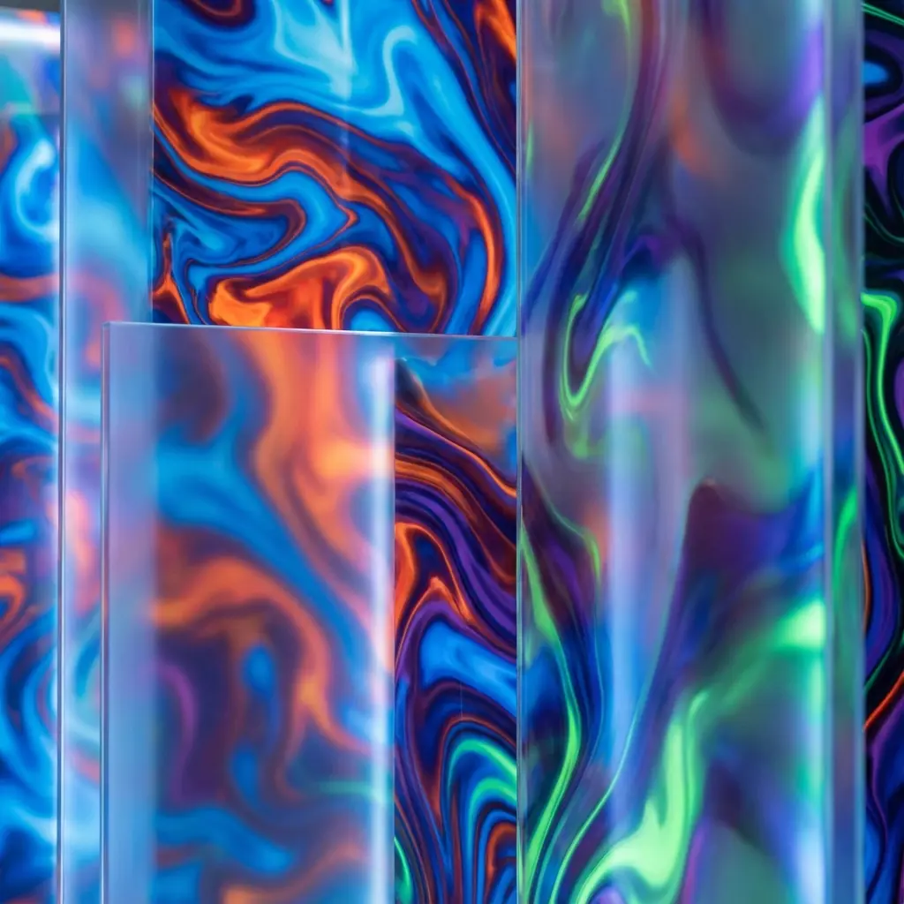

# Art Gallery 2026

A modern, high-performance, static web gallery for artists. Built with vanilla HTML, CSS, and JavaScript, designed to be future-proof, fast, and aesthetically pleasing.



## Features

-   **Modern Design**: Dark mode aesthetic with glassmorphism elements, subtle animations, and responsive layout.
-   **Dynamic Content**: Album-based structure driven by simple JSON configuration files.
-   **Media Support**: Native support for **high-res images** (WebP, PNG, JPG) and **video content** (MP4, WebM).
-   **Immersive Lightbox**:
    -   Fullscreen viewing.
    -   **Deep Zoom**: Mouse wheel zoom with pan support.
    -   Keyboard navigation (Arrow keys, Esc).
    -   Touch gestures (Swipe to close/navigate - *roadmap*).
-   **Video Playback**:
    -   Hover-to-play previews in grid view.
    -   Full player with controls in lightbox mode.
-   **Zero Dependencies**: No frameworks, no build steps. Just pure web technologies.

## Getting Started

### Prerequisites

You only need a simple HTTP server to run this locally. Python 3 is verified to work perfectly.

### Installation & Running

1.  Clone the repository:
    ```bash
    git clone https://github.com/yourusername/gallery.git
    cd gallery
    ```

2.  Start the local server:
    ```bash
    python3 server.py
    ```

3.  Open your browser at `http://localhost:8000`.

## Deployment

### GitHub Pages (Automated)

This repository includes a GitHub Actions workflow for automatic deployment.

1.  Push your code to **GitHub**.
2.  Go to your repository **Settings** > **Pages**.
3.  Under **Build and deployment** / **Source**, select **GitHub Actions**.
4.  The action will automatically trigger on your next push to the `main` branch.

## Adding Content

The gallery uses a file-system based approach managed by JSON manifests.

### 1. Create an Album Directory
Create a new folder inside `albums/`.
```bash
mkdir albums/my-new-art
```

### 2. Add Media
Place your images and videos in this folder.

### 3. Create Manifest
Create a `manifest.json` inside your album folder:
```json
{
    "title": "My New Art",
    "description": "Collection description...",
    "images": [
        {
            "filename": "art1.jpg",
            "title": "Artwork One",
            "description": "Oil on canvas, 2024"
        }
    ]
}
```

### 4. Register Album
Add your new album to the global `config.json` in the root directory:
```json
{
    "albums": [
        ...,
        {
            "id": "my-new-art",
            "path": "albums/my-new-art",
            "title": "My New Art",
            "cover": "art1.jpg"
        }
    ]
}
```

## Customization

-   **Styles**: Edit `css/variables.css` to change colors, fonts, and spacing.
-   **Logic**: Core logic is in `js/main.js` and `js/view.js`.

## License

[MIT](LICENSE)
